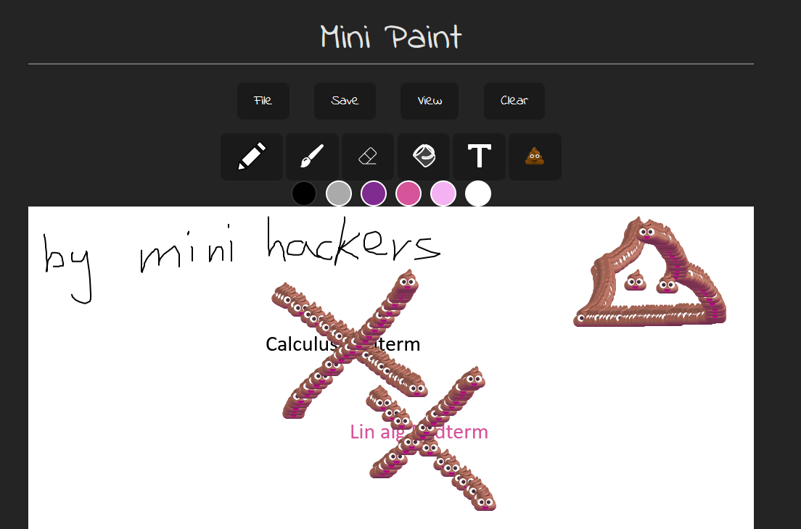

# 💩 Minini Paint

A chaotic, lighthearted MS Paint–style app built in **6 hours** during the TMU MUES Hackathon.



## 🎨 Overview

Minini Paint is a playful spin on MS Paint, designed to help you express yourself, especially after a long week of midterms.  
The highlight? The **Poop Pen**, a custom brush that lets you *literally* smear poop across the canvas to release your stress (and creativity).
 
We built this as a fun, expressive art app where you can doodle, erase, clear your canvas, and experiment with different pen modes, including one that’s a little too honest about how exams feel sometimes. 💀

## ⚙️ Tech Stack

- **Svelte** – for building fast, reactive UI components  
- **Vite** – for lightning-fast bundling and hot reload  
- **Konva.js** – for all the canvas drawing logic (brushes, erasing, smearing, etc.)  

Frontend only — no backend, no database, pure browser chaos.

## 🧠 Features

- ✏️ Basic brush tool for freehand drawing  
- 💩 Poop Pen for smearing colors (and emotions)  
- 🧽 Eraser tool that preserves the background  
- 🧼 Clear canvas button  
- 💾 Download your masterpiece  

## 🚀 Getting Started

```bash
# 1. Clone this repository
git clone https://github.com/caasion/mini-paint.git
cd mini-paint

# 2. Install dependencies
npm install

# 3. Run the app locally
npm run dev

# Then, read the console to open it in your local browser!
```

## 🧩 Hackathon Details

Built for the **TMU MUES Hackathon 2025** under the theme: *“Create your own MS Paint.”*
We had 6 hours to brainstorm, design, and ship an MVP from scratch--and it was the first hackathon for all of us.

### Team Members

* Shreya Gavande – UI Design
* Nisha Radle – UI Design
* Hareth Hameed – Pitch & Presentation
* Isaac Ng – Svelte Developer (that's me!)

## 💡 What I Learned

This was my first-ever hackathon, and I learned more in 8 hours than in an entire week at school.

* How to **collaborate with new teammates** I’d just met on the spot
* How to **build an MVP fast** instead of chasing perfection
* How to **learn tools on the fly**, like Konva.js and Svelte
* And most importantly, how to have fun and create under pressure

We didn’t win a prize, but we walked away with experience, memories, and courage (plus a working Poop Pen).

## 📸 Demo / Screenshots

*(Coming soon – pending final pitch slides and screenshots)*

---

Made with 💩, ☕, and way too many midterms.
